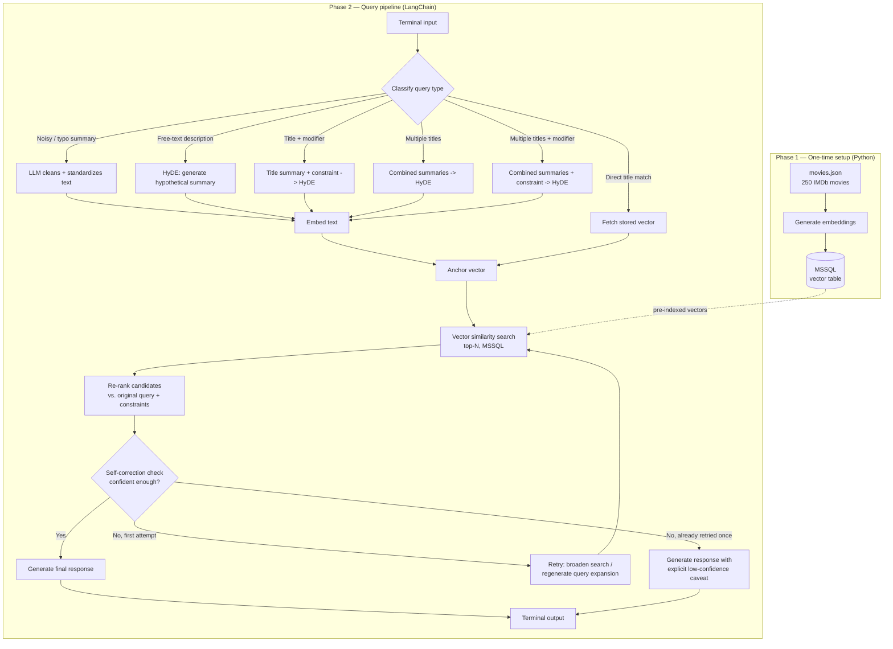

# AskCael — Movie Recommendation System RAG Demo

## Objective

A conversational movie recommendation system that takes natural-language input (a movie title, a plot description, or a comparison to known movies) and returns relevant recommendations with reasoning, using Retrieval-Augmented Generation (RAG) over a local movie database.

This document describes the **demo scope**: a terminal application (no web interface) that proves out the core retrieval and generation pipeline. It is intended to be shown to a university supervisor as evidence the full project is feasible, ahead of a 10-month full build (web app, larger multi-category database, full deployment).

## Architecture Overview



## Pipeline Phases

### Phase 1 — Database setup (plain Python, run once)

A standalone script reads `movies.json`, generates an embedding for each movie summary, and writes `title`, `summary`, and the resulting vector into an MSSQL table (SQL Server 2025's native `VECTOR` type). This runs once per catalog version — not on every query, and not through LangChain. It is a simple, linear ETL job and does not need an orchestration framework.

### Phase 2 — Query pipeline (LangChain)

Everything that happens per user query is built as LangChain components rather than hand-written control flow:

- **Query classification / routing** — determines which of the six query-type cases (below) applies
- **Query expansion (HyDE)** — for vague or comparison-style queries, an LLM generates a hypothetical full-length summary before embedding, closing the gap between short queries and long stored summaries
- **Retrieval** — vector similarity search against the MSSQL-stored embeddings, returning the top-N nearest movies
- **Re-ranking** — a second LLM pass re-scores the retrieved candidates against the original user intent, correcting cases where embedding similarity alone picked a merely-adjacent result
- **Self-correction** — a confidence check on the re-ranked candidates; if quality looks weak, the pipeline retries once — broadening the search or regenerating the query expansion — before falling back to a final response with an explicit low-confidence caveat if the retry still doesn't produce a strong match. The retry is capped at one attempt to keep response time bounded.
- **Response generation** — the LLM turns the anchor movie, retrieved candidates, and original query into a natural-language recommendation, instructed to reference only the retrieved candidates (no invented titles)

LangChain is used here specifically because it has existing abstractions that map onto these concepts (hypothetical-document embedding for query expansion, contextual compression / re-ranking retrievers, and graph-based orchestration for the self-correction loop) — the goal is to use those idioms rather than reimplementing this control flow from scratch.

## Query Type Handling

| # | Query type | Example | Handling |
|---|---|---|---|
| 1 | Noisy / typo summary | Long summary with typos or noise | LLM cleans and standardizes text, then embeds |
| 2 | Free-text description | "rom-com with drama with a bit of horror" | HyDE, then embeds |
| 3 | Direct title match | "something like Inception" | Loads the referenced movie's stored vector |
| 4 | Title + modifier | "Inception but more emotional" | Referenced summary + constraint passed to LLM, HyDE, then embeds |
| 5 | Multiple titles | "Inception and Interstellar" | Combined summaries passed to LLM, HyDE, then embeds |
| 6 | Multiple titles + modifier | "Inception and Interstellar but more emotional" | Combined summaries + constraint passed to LLM, HyDE, then embeds |

## Tech Stack

- **Orchestration:** LangChain (query pipeline only — not database setup)
- **LLM:** Gemini API (Flash / Flash-Lite, free tier) — local Ollama model as offline fallback
- **Embeddings:** Gemini embedding model (free tier) — `sentence-transformers` as offline fallback
- **Database:** MSSQL (SQL Server 2025), native `VECTOR` column type, brute-force `VECTOR_DISTANCE` search (no ANN index needed at this data scale)
- **Interface:** terminal only for this demo — no web layer

## Data Acquisition

`movies.json` was produced by an existing web scraper, already built and used to collect the 250 IMDb movie titles and summaries that make up the demo dataset. This is a one-off script, run separately from the pipeline described above — it is not part of the Phase 1/Phase 2 flow, it just produces the input file that Phase 1 consumes.

## Configuration & Secrets


- All secrets (API key, MSSQL server/connection details) live in a local file inside a dedicated folder, e.g. `secrets/config.txt`, which is never committed
- `config.py` reads its values from that file at startup — no secret values appear directly in any source file
- The `secrets/` folder is listed in `.gitignore`, along with standard Python ignores (`__pycache__/`, `*.pyc`, virtual environment folders, etc.)
- A `secrets/config.example.txt` template, with placeholder values only, **is** committed — so anyone cloning the repo knows what keys/fields are expected without exposing real values

## Known Limitations (demo scope)

- The current dataset (`movies.json`) contains only titles and summaries — no genre, cast, director, or country metadata. Filtering by these fields is part of the target architecture but is **not functional in this demo** since the underlying data doesn't support it yet. Metadata-based filtering is planned for the full project once the database is expanded.
- Single category only (movies). Series, games are planned for the full project, not this demo.
- Terminal interface only — no web app in this phase.

## Suggested Project Structure

```
data/
    movies.json
secrets/
    config.txt              # real values — gitignored, never committed
    config.example.txt      # placeholder template — committed
scraper.py               # existing script that produced movies.json
src/
    config.py         # DB connection, model names, top-N, etc. — reads from secrets/config.txt
    embedding.py       # embedding calls (Gemini + local fallback)
    database.py        # MSSQL connection, schema, insert, vector search
    chains.py           # LangChain components: routing, HyDE, re-rank, self-correction, generation
build_database.py       # one-time indexing script (Phase 1)
main.py                 # terminal entry point (Phase 2 loop)
requirements.txt
.gitignore
README.md
```

## Future Work (beyond this demo — 4-month full project)

- Resolve long-term LLM API access (current plan uses region/VPN workarounds that carry risk of being cut off)
- Expand dataset with genre, cast, director, country, and release-date metadata to enable filtering
- Add additional categories: series, games
- Extend the existing web scraper into an agentic component that can autonomously discover and add new entries, rather than running as a one-off manual script
- Build and deploy a full web application (currently terminal-only)
