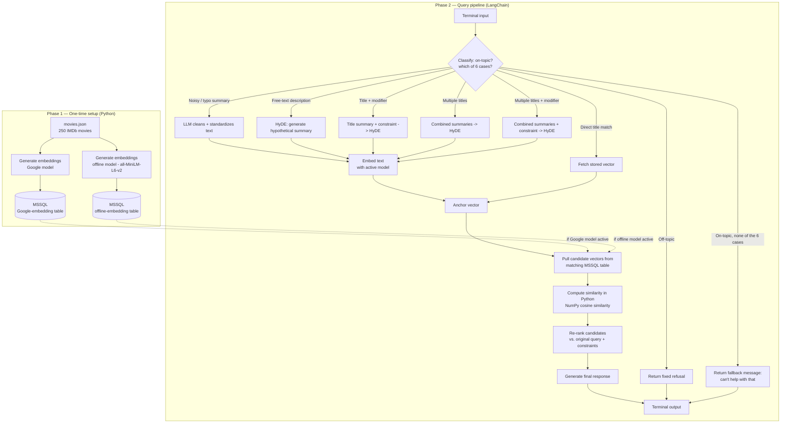

# AskCael — Movie Recommendation RAG Demo

## Objective

A conversational movie recommendation system that takes natural-language input (a movie title, a plot description, or a comparison to known movies) and returns relevant recommendations with reasoning, using Retrieval-Augmented Generation (RAG) over a local movie database.

This document describes the **demo scope**: a terminal application (no web interface) that proves out the core retrieval and generation pipeline. It is intended to be shown to a university supervisor as evidence the full project is feasible, ahead of a 4-month full build (web app, larger multi-category database, full deployment).

## Project Naming

The project is named **AskCael**, with `askcael.ir` and `askcael.com` reserved as the eventual domains. This repository, `askcael-demo`, holds only the terminal-based demo described here; the full web-deployed version will be forked from this repo into a separate `askcael` repository once the demo is approved.

## Architecture Overview



## Pipeline Phases

### Phase 1 — Database setup (plain Python, run once)

A standalone script reads `movies.json` and generates embeddings for each movie summary using **two separate embedding models: Google's embedding API (`gemini-embedding-001`, truncated to 768 dimensions), and an offline model (`all-MiniLM-L6-v2`, run locally via `sentence-transformers`)**. Because vectors from different embedding models are not comparable to each other, each model's output goes into its own MSSQL table (`title`, `summary`, `vector`, using SQL Server 2025's native `VECTOR` type). Which table is queried at runtime depends on which embedding model is currently active — this is a fixed choice per run, not an automatic runtime fallback. This setup runs once per catalog version — not on every query, and not through LangChain. It is a simple, linear ETL job and does not need an orchestration framework.

### Phase 2 — Query pipeline (LangChain)

Everything that happens per user query is built as LangChain components rather than hand-written control flow:

- **Query classification / routing** — a single LLM call determines both whether the query is on-topic and, if so, which of the six query-type cases (below) applies — merged into one call rather than two separate ones, since both are just outcomes of the same classification decision. Title recognition (cases 3-6) is done by the LLM itself, not regex or string matching — this is deliberate, since it lets the system recognize a title from a typo or partial mention ("incption" → *Inception*) the way a person would, which pattern matching can't do.
- **Query expansion (HyDE)** — for vague or comparison-style queries, an LLM generates a hypothetical full-length summary before embedding, closing the gap between short queries and long stored summaries
- **Matched-movie exclusion** — every movie the user explicitly named or referenced (cases 3-6) is excluded from the final recommendation results, regardless of how many were named. If the user mentions 10 titles, all 10 are excluded from the output, even though the pipeline may only use a subset of them to build the anchor (see next point).
- **Multi-title cap** — cases 5 and 6 cap the number of referenced movies actually fed into the HyDE generation step at 3, to keep the prompt short and the resulting hypothetical summary focused. If more than 3 titles are mentioned, the LLM selects which 3 are most relevant to the user's request rather than taking them in listed order.
- **Retrieval** — the installed SQL Server 2025 instance supports the `VECTOR` column type but not built-in semantic search, so the pipeline pulls candidate vectors from the matching MSSQL table (Google or offline, whichever is active) into Python and computes cosine similarity with NumPy to get the top-N nearest movies
- **Re-ranking** — a second LLM pass re-scores the retrieved candidates against the original user intent, correcting cases where embedding similarity alone picked a merely-adjacent result
- **Response generation** — the LLM turns the anchor movie, retrieved candidates, and original query into a natural-language recommendation, instructed to reference only the retrieved candidates (no invented titles)
- **Fallback for unclassifiable queries** — if a query doesn't cleanly fit any of the six cases, the pipeline does not guess or crash; it returns a fixed message telling the user the system can't help with that request as phrased and suggesting they try rephrasing, then keeps running normally for the next query.

LangChain is used here specifically because it has existing abstractions that map onto these concepts (hypothetical-document embedding for query expansion, contextual compression / re-ranking retrievers) — the goal is to use those idioms rather than reimplementing this control flow from scratch. Self-correction (a confidence-check retry loop) is deliberately left out of this demo — see Future Work.

## Query Guardrails (Staying On-Topic)

Every query passes an on-topic check — this stops the system being used for unrelated tasks (homework, code generation, general chat) the way general-purpose chatbots deployed on narrow-purpose interfaces sometimes are. Three layers:

1. **On-topic check, merged into the classification call** — the same LLM call that assigns a query to one of the six cases also decides whether it's a movie-recommendation request at all. If not, it returns a fixed, polite refusal immediately, without touching retrieval or the main generation prompt.
2. **Hardened system prompt** — the assistant's prompt states its narrow purpose explicitly and instructs it to decline anything else. This is a second layer, not the only one — a system prompt alone can be talked around by a sufficiently determined user, which is why step 1 exists as an independent check in front of it.
3. **Retrieved data treated as data, not instructions** — movie summaries (sourced from the scraper) are only ever referenced as content to describe in the generation prompt, never treated as instructions to follow, in case any scraped text ever contains something instruction-like.

## Query Type Handling

| # | Query type | Example | Handling |
|---|---|---|---|
| 1 | Noisy / typo summary | Long summary with typos or noise | LLM cleans and standardizes text, then embeds |
| 2 | Free-text description | "rom-com with drama with a bit of horror" | HyDE, then embeds |
| 3 | Direct title match | "something like Inception" (or "incption") | LLM recognizes the title (typos included), loads its stored vector; the movie itself is excluded from results |
| 4 | Title + modifier | "Inception but more emotional" | Referenced summary + constraint passed to LLM, HyDE, then embeds; that movie excluded from results |
| 5 | Multiple titles | "Inception and Interstellar" (or 10 titles) | LLM identifies all named titles; up to 3 most relevant are combined for HyDE; **all** named titles excluded from results, however many there were |
| 6 | Multiple titles + modifier | "Inception and Interstellar but more emotional" | Same as case 5, plus the constraint passed alongside the combined summaries to HyDE |
| — | None of the above | Off-topic, gibberish, or unrecognizable request | Fixed fallback message; no retrieval or generation attempted |

## Tech Stack

- **Orchestration:** LangChain (query pipeline only — not database setup)
- **LLM:** Gemini API (Flash / Flash-Lite, free tier) — local Ollama model as offline fallback
- **Embeddings:** two options — Google's `gemini-embedding-001` (truncated to 768 dimensions) or `all-MiniLM-L6-v2` (offline, via `sentence-transformers`, 384 dimensions) — since the two are not vector-compatible, each has its own MSSQL table, and only one is active per run (no automatic runtime fallback between them)
- **Database:** MSSQL (SQL Server 2025), native `VECTOR` column type. The installed instance does not have semantic search / native distance functions enabled, so similarity is computed in Python with NumPy after pulling candidate vectors, not via an in-database vector search function
- **Interface:** terminal only for this demo — no web layer

## Data Acquisition

`movies.json` was produced by an existing web scraper, already built and used to collect the 250 IMDb movie titles and summaries that make up the demo dataset. This is a one-off script, run separately from the pipeline described above — it is not part of the Phase 1/Phase 2 flow, it just produces the input file that Phase 1 consumes.

## Configuration & Secrets

- All secrets (API key, MSSQL server, database name, username, password) live in a local file inside a dedicated folder, e.g. `secrets/config.txt`, which is never committed
- `config.py` reads its values from that file at startup — no secret values appear directly in any source file
- The `secrets/` folder is listed in `.gitignore`, along with standard Python ignores (`__pycache__/`, `*.pyc`, virtual environment folders, etc.)
- A `secrets/config.example.txt` template, with placeholder values only, **is** committed — so anyone cloning the repo knows what keys/fields are expected without exposing real values

## Known Limitations (demo scope)

- The current dataset (`movies.json`) contains only titles and summaries — no genre, cast, director, or country metadata. Filtering by these fields is part of the target architecture but is **not functional in this demo** since the underlying data doesn't support it yet. Metadata-based filtering is planned for the full project once the database is expanded.
- Single category only (movies). Series, books, games, and songs are planned for the full project, not this demo.
- Terminal interface only — no web app in this phase.
- No native in-database vector search — the installed SQL Server 2025 instance supports the `VECTOR` type but not semantic search, so retrieval pulls vectors into Python and computes similarity with NumPy.
- No automatic fallback between the Google and offline embedding models — whichever is active determines which MSSQL table is used; switching requires re-running the pipeline against the other table, not a runtime failover.
- No self-correction / retry loop in this demo — with only 250 movies, a retry is unlikely to surface meaningfully different candidates, so it isn't worth the added complexity here. See Future Work.

## Suggested Project Structure

```
data/
    movies.json
secrets/
    config.txt              # real values — gitignored, never committed
    config.example.txt      # placeholder template — committed
scraper.py               # existing script that produced movies.json
src/
    config.py         # DB connection, model names, top-N, etc. — reads from secrets/config.txt
    embedding.py       # embedding calls (Google model + offline model, no auto-fallback)
    database.py        # MSSQL connection, schema for both embedding tables, insert, NumPy similarity search
    chains.py           # LangChain components: routing, HyDE, re-rank, generation
build_database.py       # one-time indexing script (Phase 1)
main.py                 # terminal entry point (Phase 2 loop)
requirements.txt
.gitignore
README.md
```

## Future Work (beyond this demo — 4-month full project)

- Resolve long-term LLM API access (current plan uses region/VPN workarounds that carry risk of being cut off)
- Expand dataset with genre, cast, director, country, and release-date metadata to enable filtering
- Add additional categories: series, games
- Extend the existing web scraper into an agentic component that can autonomously discover and add new entries, rather than running as a one-off manual script
- Add a self-correction / retry loop — worth revisiting once the catalog is large enough that a retry could plausibly surface better candidates
- Build and deploy a full web application (currently terminal-only)
